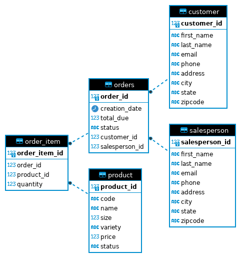

# Introduction
This is a JDBC application, which uses the Java Database Connectivity API to connect to a PostgresSQL database allowing for the application to query for results and update the database. It is used by developers who want to access the database from their applications, as ultimately applications may have to store large amounts of data so they will need some sort of database to store it, and being able to connect to it from the application for transaction handling is very important.Database was initialized using PostgresSQL, and the application connecting to the database was implemented using Java with the JDBC API, project build and management was done using Maven.

# Implementation
## ER Diagram

## Design Patterns
The DAO (Data Access Object) pattern was employed to decouple the business logic and data persistence layer. The main DAO class represents the CRUD operations that can be performed on an object and each entity in the program will rely on its specific DAO class to perform CRUD operations against the database without needing to know how it works. This is an example of a repository pattern, which is defined to isolate the data layer from the rest of the application logic. The DAO classes would be a part of the data layer and provide an API for the rest of the application to use to access the data.

# Test
Testing was done manually through running the application and connecting to the database after each CRUD operation to see if the data was consistent.
