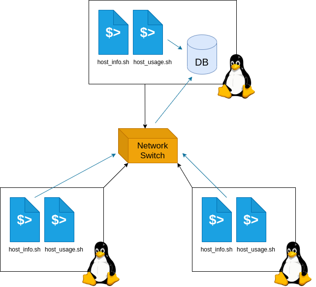

# Linux Cluster Monitoring Agent

# Introduction
A computer cluster is a collection of machines that are connected internally using a switch device, through which they can communicate through their internal IP address. The monitoring agent software, which is installed on every machine in the cluster, monitors the hardware usage of an individual machine and inserts that information into a database periodically. System administrators and those in charge of managing the computer cluster will use the data gathered by this software to plan future resource distributions (delegating machines to different tasks). Data collection is done using two BASH scripts, one for collecting data on hardware information and the other for collecting hardware usage data. Data persistence is done using the PostgreSQL RDBMS, of which an instance is provisioned using Docker.

# Quick Start
First create and start up a `psql` instance with `psql_docker.sh` with username `postgres` and password `password`.
```.bash
./scripts/psql_docker.sh create postgres password
./scripts/psql_docker.sh start
```
Connect to the `psql` instance and create a new database `host_agent`.
```.bash
psql -h localhost -U postgres -W
postgres=# CREATE DATABASE host_agent;
```
Then generate the database tables with `ddl.sql`.
```.bash
psql -h localhost -U postgres -d host_agent -f sql/ddl.sql
```
To insert data on hardware specifications for the current machine run the `host_info.sh` script.
```.bash
./scripts/host_info.sh localhost 5432 host_agent postgres password
```
To insert data on current hardware usage run the `host_usage.sh` script.
```.bash
./scripts/host_usage.sh localhost 5432 host_agent postgres password
```
To automate the gathering of hardware usage data every minute, add this line to your `crontab` file (access using `crontab -e` command).
Replace the path with the full path from `pwd` to the `host_usage.sh` script on your machine.
```.bash
* * * * * .../host_usage.sh localhost 5432 host_agent postgres password > /tmp/host_usage.log
```

# Implementation
First the environment was set up using the `psql_docker.sh` script, which built
a Docker container with a `psql` instance using the PostgreSQL image.
Then the database schema was defined in the `ddl.sql` script which connected to the
main database and generated the two tables `host_info` and `host_usage` for each host
machine. The `host_usage.sh` and `host_info.sh` both extracted data from
the outputs of Linux commands such as `lscpu` (CPU information) and `vmstat` (CPU usage information),
and an insertion query based on the extracted data would be run on the database.
Automation was implemented through adding a command to run the `host_usage.sh` script
every minute in the `crontab` file.

## Architecture


## Scripts
- `psql_docker.sh`
  - Creates a Docker container called `jrvs-psql` using the official PostgresSQL 9.6 Alpine image. If the container has been created, it is also responsible for stopping and starting the container.
  - Usage:
    - ```shell
      # Create a psql docker container with login info
      ./scripts/psql_docker.sh create [USERNAME] [PASSWORD]
      
      # Start the container
      ./scripts/psql_docker.sh start
      
      # Stop the container
      ./scripts/psql_docker.sh stop
      ```
- `host_info.sh`
  - Inserts a row of hardware specification data on the current machine into the `host_info` table.
  - Usage:
    - ```shell
      ./scripts/host_info.sh [HOST_NAME] [PORT_NUM] [DATABASE] [PSQL_USERNAME] [PSQL_PASSWORD]
      ```
- `host_usage.sh`
  - Inserts a row of hardware usage data on the current machine into the `host_usage` table.
  - Usage:
    - ```shell
      ./scripts/host_usage.sh [HOST_NAME] [PORT_NUM] [DATABASE] [PSQL_USERNAME] [PSQL_PASSWORD]
      ```
- `ddl.sql`
  - Generates two tables `host_info` and `host_usage` in the `host_agent` database if they do not exist.
  - Usage:
    - ```shell
      psql -h [HOST_NAME] -U [PSQL_USERNAME] -d host_agent -f sql/ddl.sql
      ```
- `crontab`
  - Automates the insertion of hardware usage data by running the `host_usage.sh` script is run every minute.
  - Insert the following line into your `crontab` file, replacing `...` with the full path to the script:
    - ```
      * * * * * .../host_usage.sh localhost 5432 host_agent postgres password > /tmp/host_usage.log
      ```
## Database Modelling
Here is the schema used for the database:
- `host_info`

  | Column | Data Type | Description |
      | ------ | --------- | ----------- |
  | `id` | Integer | Unique ID (Primary Key) |
  | `hostname` | String | Hostname of machine, must be unique |
  | `cpu_number` | Integer | Number of CPU cores |
  | `cpu_architecture` | String | CPU architecture |
  | `cpu_model` | String | Model of CPU |
  | `cpu_mhz` | Float | CPU clock speed (MHz) |
  | `l2_cache` | Integer | L2 cache size (kB) |
  | `"timestamp"` | Timestamp | Current time (yyyy-mm-dd hh:mm:ss) |
  | `total_mem` | Integer | Total amount of idle virtual memory (kB)

- `host_usage`

  | Column | Data Type | Description |
      | ------ | --------- | ----------- |
  | `"timestamp"` | Timestamp | Current time (yyyy-mm-dd hh:mm:ss) |
  | `host_id` | Integer | Host ID (References `id` in `host_info`)|
  | `memory_free` | Integer | Total amount of idle virtual memory (MB) |
  | `cpu_idle` | Integer | CPU time spent idle (%) |
  | `cpu_kernel` | Integer | CPU time spent running kernel code (%) |
  | `disk_io` | Integer | All current disk I/O reads and writes in progress |
  | `disk_available` | Integer | Available disk space in root directory (MB) |

# Test
Testing was mainly done through running the scripts and verifying the result. For both the `host_info.sh` and `host_usage.sh` scripts, after running the script the database was checked to see if the row contained the correct information. The `psql_docker.sh` script functionality was tested by verifying that the container was properly created with the correct properties and that the `start` and `stop` commands correctly started and stopped the container.

# Deployment
- The project requires an environment with a PostgreSQL database, which is handled through the creation of a Docker container using the official PostgreSQL image.
- Hardware usage is recorded into the database every minute, which is handled by automation using the `crontab` file. A command running the `host_usage.sh` script is added to the `crontab` file in order for it to insert data every minute.
- The entire project is available on the Github repository, which was used throughout the entire development process to develop new features and add them to the project.

# Improvements
Here are some potential improvements to be implemented in the future:
- Adding more fields to our database schema to track more information about the hardware usage. For example, we could separate tracking disk I/O into disk reads and disk writes for more robust data.
- Implementing a GUI that displays a graph of the usage data over a period of time. This allows for a more user-friendly experience.
- Allow for the user to have more control over the hardware usage database by implementing ways for the user to control the automation (changing how frequently hardware data is inserted). 